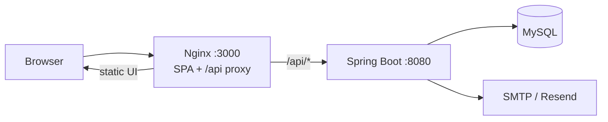
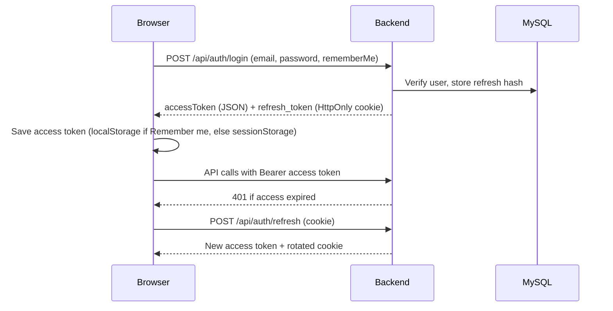

# Architecture

Mawrid is a **single-page React client** plus a **stateless Spring Boot REST API**. The browser talks to the API as `/api/...`. In production, Nginx on the frontend container reverse-proxies `/api/` to the backend so the site can use one domain.

## High-level view



Local development skips Nginx: Vite (`localhost:5173`) proxies `/api` to `localhost:8080`.

## Request path (production)

1. User opens `https://mawrid.cloudbase.website`.
2. Nginx serves `index.html` and hashed JS/CSS.
3. The React app calls `/api/...` on the same origin.
4. Nginx forwards `/api/` to `http://mawrid-backend:8080`.
5. Spring Security checks JWT (`Authorization: Bearer`) except for a small public allow-list.
6. Controllers use `TenantAccess` so a college admin cannot act on another college’s `tenantId`.
7. JPA writes to MySQL. Hibernate `ddl-auto=update` owns the schema.

## Multi-tenancy

Each college is a row in `tenants`. Almost every domain table has `tenant_id`.

| Actor | Tenant in JWT (`tid`) | Data they see |
|-------|----------------------|----------------|
| USER | Their college | Catalog ranked by AI recommendation score (own college demand is one of the signals), their requests |
| ADMIN | Their college | Inventory, requests, checking for that college only |
| SUPER_ADMIN | `null` | All colleges and users; global dashboard |

`SUPER_ADMIN` bypasses tenant matching in `TenantAccess.requireTenant`. Everyone else must send a `tenantId` that matches their token.

## Session model



Details: [security.md](security.md).

## Frontend layers

- **Routes** (`frontend/src/app/routes.tsx`) — public vs role-gated trees
- **Guards** — `GuestOnly`, `RequireAuth`, `RequireActiveAdminCollege`
- **Layouts** — sidebar shells per role
- **API client** (`frontend/src/app/api/client.ts`) — JSON fetch, token header, refresh on 401

## Backend layers

```
Controller → Service → Repository → Entity / MySQL
                 ↘ EmailService, JwtService, TenantAccess
```

Package map: [backend.md](backend.md). Catalog ranking: [ai-recommendation.md](ai-recommendation.md).
