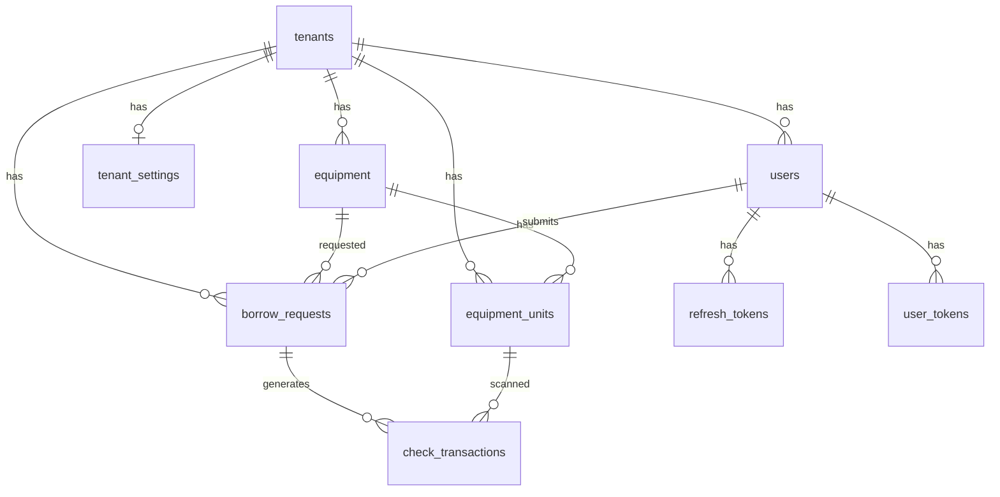

# Database

MySQL 8. Schema is created/updated by Hibernate (`spring.jpa.hibernate.ddl-auto=update`). There is no Flyway/Liquibase changelog in the repo.

## Database names

| Environment | Database | Where |
|-------------|----------|--------|
| Local default | `Mawrid_db` | `application.properties` |
| `docker-compose` | `mapping_db` | `docker-compose.yml` |
| Production | Set via `SPRING_DATASOURCE_URL` | CloudBase / host env |

## Entity-relationship (logical)

## Tables

| Table | Entity | Notes |
|-------|--------|--------|
| `tenants` | Tenant | `code` unique; `status` string (`ACTIVE` / `INACTIVE`) |
| `tenant_settings` | TenantSettings | PK `tenant_id`; borrow rules |
| `users` | User | Unique `email`; `role`; optional `tenant_id`; `last_sent_at` for email rate limiting |
| `equipment` | Equipment | Quantities, category, availability window |
| `equipment_units` | EquipmentUnit | `serialNo`, `assetTag`, unit `status` |
| `borrow_requests` | BorrowRequest | Dates, status, decision fields |
| `check_transactions` | CheckTransaction | `CHECK_OUT` / `CHECK_IN` |
| `refresh_tokens` | RefreshToken | Hashed refresh; rotation / revoke |
| `user_tokens` | UserToken | OTP and verify/reset hashes |
| `activity_logs` | ActivityLog | Audit trail |
| `dismissed_dashboard_alerts` | DismissedDashboardAlert | Per-tenant dismissed keys |

## Status strings (not DB enums)

**Borrow request:** `PENDING`, `APPROVED`, `REJECTED`, `ON_LOAN`, `BORROWED` (legacy alias), `RETURNED`, `CANCELLED`

**Equipment unit:** `AVAILABLE`, `BORROWED`, `MAINTENANCE`

**Tenant:** `ACTIVE`, `INACTIVE`

## Maintenance SQL

Under `backend/scripts/`:

- `cascade_delete_user_fk.sql`
- `reset_super_admin_tenant.sql`

Use only when you know the target database; they are not part of the normal app boot.
