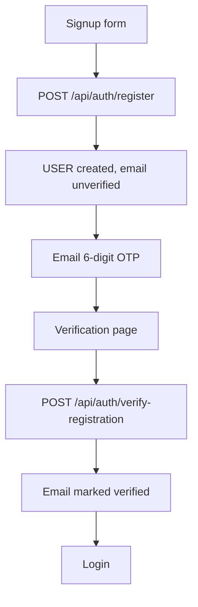
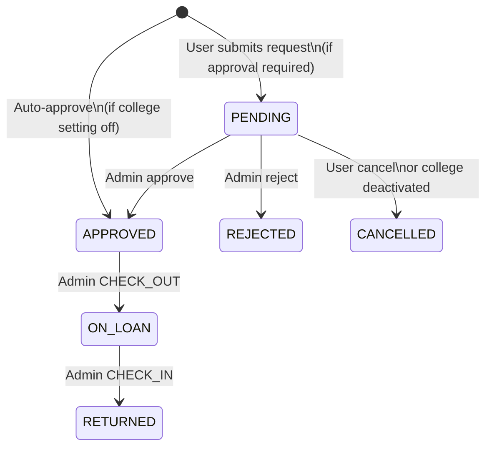

# User flows

## Signup and verification

- OTP type: `REGISTRATION_OTP` (about 10 minutes).
- Resend: `POST /api/auth/resend-verification` (cooldown applies).
- A legacy link flow still exists: `GET /api/auth/verify-email?token=`.

## Login and session

1. `POST /api/auth/login` with email and password.
2. Backend checks password, email verified, college not removed, and (for ADMIN) college `ACTIVE`.
3. Response body includes `accessToken` and user fields. Refresh token is set as cookie `refresh_token`.
4. Frontend stores the access token and user snapshot, then **replaces** history with the role dashboard.
5. Authenticated visitors who open `/login` or `/` are sent back to that dashboard (`GuestOnly`).

## Password reset

1. `POST /api/auth/forgot-password` → OTP email (`PASSWORD_RESET_OTP`, about 5 minutes).
2. `POST /api/auth/verify-reset-otp` → temporary password emailed.
3. Alternate: `POST /api/auth/reset-password` with a link token (`PASSWORD_RESET`).

Forgot-password does not reactivate a locked account or skip email verification.

## Borrow lifecycle

Unit statuses move with check-out / check-in:

- Check-out: unit `AVAILABLE` → `BORROWED`, request → `ON_LOAN`
- Check-in: unit → `AVAILABLE` or `MAINTENANCE`, request → `RETURNED`

`BORROWED` on a **request** is treated as an on-loan alias in some check-in paths (legacy/seed data).

## Checking (admin)

Path: `/admin/checking`

- Pending handovers: approved requests not yet checked out
- Pending returns: items on loan
- Scan: `POST /api/tenants/{tenantId}/check-transactions/scan` with `{ serialNo }`

Check-in is only allowed from `ON_LOAN` / `BORROWED`. Scan must match the correct student when several approved requests exist.

## Super admin college lifecycle

| Action | Effect |
|--------|--------|
| Create college | Status `ACTIVE`, optional settings (`maxBorrowDays`, `approvalRequired`, `cutoffTime`) |
| Set `INACTIVE` | Admin login blocked; pending requests cancelled |
| Delete college | Cascade inventory and requests; users detached and deactivated |

USER layout and ADMIN layout poll tenant status and force logout with an error query on the login page when the college is gone.
